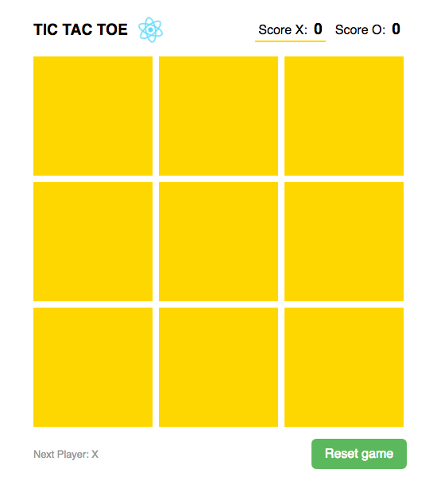

# REACT TIC TAC TOE

A simple game to learn REACT | [antoniomasia.com](http://antoniomasia.com)

## Installation

Thi install this app, you have to clone this repo and move to the root directory and run this command:

`yarn install`

## Start scripts

Run any of the following commands depending on how you want to work:

| Command      | Mode                                                    |
| ------------ | ------------------------------------------------------- |
| `yarn start` | Run the app in the development mode                     |
| `yarn build` | Builds the app for production to the `build` folder     |
| `yarn test`  | Launches the test runner in the interactive watch mode. |
| `yarn eject` | Eject app from development environment                  |

## Playing

The object of Tic Tac Toe is to get three in a row. You play on a three by three game board. The first player is known as X and the second is O. Players alternate placing Xs and Os on the game board until either oppent has three in a row or all nine squares are filled. X always goes first, and in the event that no one has three in a row, the stalemate is called a cat game.

Is you touch `Reset button`, the scores are initialized.

## Codding notes

REACT development environment created with `create-react-app` tool.
Extra libraries used:

* [Styled Compoments](https://www.styled-components.com/)
* [sweetalert2](https://sweetalert2.github.io/)
* [Prop Types](https://github.com/facebook/prop-types)

## Next features

* [Redux](https://redux.js.org/) implement
* Computer as player using IA

## License

MIT License

Copyright (c) 2018 Antonio José Masiá

Permission is hereby granted, free of charge, to any person obtaining a copy
of this software and associated documentation files (the "Software"), to deal
in the Software without restriction, including without limitation the rights
to use, copy, modify, merge, publish, distribute, sublicense, and/or sell
copies of the Software, and to permit persons to whom the Software is
furnished to do so, subject to the following conditions:

The above copyright notice and this permission notice shall be included in all
copies or substantial portions of the Software.

THE SOFTWARE IS PROVIDED "AS IS", WITHOUT WARRANTY OF ANY KIND, EXPRESS OR
IMPLIED, INCLUDING BUT NOT LIMITED TO THE WARRANTIES OF MERCHANTABILITY,
FITNESS FOR A PARTICULAR PURPOSE AND NONINFRINGEMENT. IN NO EVENT SHALL THE
AUTHORS OR COPYRIGHT HOLDERS BE LIABLE FOR ANY CLAIM, DAMAGES OR OTHER
LIABILITY, WHETHER IN AN ACTION OF CONTRACT, TORT OR OTHERWISE, ARISING FROM,
OUT OF OR IN CONNECTION WITH THE SOFTWARE OR THE USE OR OTHER DEALINGS IN THE
SOFTWARE.
